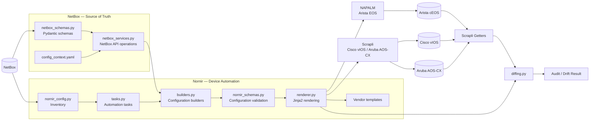

# Network Configuration Automation

**In one sentence:** this project uses **NetBox as the network source of truth** and **Nornir as the automation engine** to build, validate, deploy, and verify network device configurations across multiple vendors.

> 👋 **New to networking/IT?** You don't need to understand the code to understand the value. The project takes structured network information stored in NetBox and uses it to automate configuration across network devices instead of configuring each device manually.

---

## Project status

🚧 **Portfolio project — actively developed and tested in a virtual network lab.**

The project combines two main components:

* **NetBox** — manages the network data and acts as the source of truth.
* **Nornir** — consumes that data and orchestrates configuration and verification across network devices.

The configuration templates and device communication have been tested against virtual Cisco, Arista, and Aruba devices.

**Current limitation:** BGP templates are the remaining incomplete configuration templates. The other supported configuration sections have been implemented and tested.

---

## Why this matters

On a network with many switches and routers, a routine change — such as adding a VLAN, changing an interface, or updating a routing parameter — often means logging into each device individually and entering the appropriate commands.

That approach is:

* **Repetitive** — the same work is repeated for every device
* **Error-prone** — manual configuration can introduce inconsistencies
* **Difficult to audit** — checking whether every device matches the intended configuration requires additional manual work
* **Hard to scale** — the amount of work increases with the number of devices

This project explores a **source-of-truth-driven automation model**:

1. **NetBox stores** the structured network information
2. **Nornir retrieves and orchestrates** the devices
3. **Builders create** the intended configuration
4. **Pydantic validates** the configuration data
5. **Jinja2 renders** vendor-specific configuration
6. **The appropriate sender applies** the configuration
7. **Scrapli retrieves** the running configuration
8. **Diffing compares** intended and actual state

The same overall workflow can therefore be used across Cisco, Arista, and Aruba devices without maintaining a completely separate automation system for each vendor.

---

## Architecture



### Overall flow

```text
                         NetBox
                           │
                    Source of Truth
                           │
                           ▼
                    Nornir Inventory
                           │
                           ▼
                  Configuration Builder
                           │
                           ▼
                  Pydantic Validation
                           │
                           ▼
                    Jinja2 Renderer
                           │
              ┌────────────┼────────────┐
              │            │            │
              ▼            ▼            ▼
           NAPALM       Scrapli       Scrapli
           Arista        Cisco         Aruba
             EOS         vIOS         AOS-CX
              │            │            │
              └────────────┼────────────┘
                           │
                           ▼
                    Running Config
                           │
                        Scrapli
                           │
                           ▼
                        Diffing
                           │
                           ▼
                    Audit / Drift
```

The important design principle is the separation between **network data** and **device automation**.

> **NetBox defines the intended network state. Nornir turns that state into an automated workflow across the devices.**

---

## NetBox side

The `netbox/` package handles the source-of-truth side of the project.

It is responsible for interacting with NetBox through its API and working with structured network information such as:

* Devices
* Interfaces
* IP addresses
* VLANs
* Configuration context
* Other resources required by the automation workflow

The NetBox component uses schemas and service functions to keep the data-handling layer separate from the device-automation layer.

This allows NetBox to remain the central place where the desired network state is defined.

---

## Nornir automation side

The `automation/` package consumes the information provided by NetBox and handles the device-side workflow.

Its main responsibilities are:

### Configuration building

`builders.py` converts NetBox data into structured per-device configuration models.

### Configuration validation

`nornir_schemas.py` uses Pydantic models to validate the configuration before it is rendered and sent to a device.

### Configuration rendering

`renderer.py` uses Jinja2 templates to translate the common configuration model into the syntax required by each vendor.

### Configuration delivery

The sender depends on the device platform:

| Platform          | Sender  |
| ----------------- | ------- |
| Arista EOS / cEOS | NAPALM  |
| Cisco vIOS        | Scrapli |
| Aruba AOS-CX      | Scrapli |

This keeps the higher-level automation workflow independent of the underlying configuration transport.

### Configuration retrieval

Scrapli is used to retrieve the live running configuration from the devices.

Vendor-specific command mappings are used to retrieve the appropriate configuration sections.

### Configuration diffing

`diffing.py` compares the intended configuration generated by the automation against the configuration retrieved from the device.

Known and approved differences can be handled through the YAML exceptions mechanism.

---

## Implemented vs. remaining work

### Implemented

#### NetBox

* NetBox API integration
* NetBox data schemas
* NetBox service layer
* Resource synchronization
* Object lookup and resolution
* Device-related data management
* Configuration context support

#### Nornir

* NetBox-backed Nornir inventory
* Pydantic configuration models
* Configuration builders
* Jinja2 rendering engine
* Vendor-specific template resolution
* Configuration templates for the supported sections
* Arista EOS templates
* Cisco vIOS templates
* Aruba AOS-CX templates
* NAPALM configuration delivery for EOS
* Scrapli configuration delivery for vIOS
* Scrapli configuration delivery for AOS-CX
* Scrapli-based running configuration retrieval
* Per-vendor getter command mappings
* Configuration diffing
* YAML-based diff exceptions
* Dry-run support where supported by the sender

### Remaining work

* **BGP configuration templates**
* Additional testing and expansion as new configuration sections or vendors are added

---

## Supported vendors

The project currently targets three network platforms:

| Vendor | Virtual device | Configuration sender |
| ------ | -------------- | -------------------- |
| Arista | cEOS           | NAPALM               |
| Cisco  | vIOS           | Scrapli              |
| Aruba  | AOS-CX         | Scrapli              |

The important point is that the **automation workflow remains common**, while device-specific behavior is handled by templates and platform-specific senders/getters.

```text
                    Common workflow
                         │
              ┌──────────┼──────────┐
              │          │          │
              ▼          ▼          ▼
           Arista      Cisco      Aruba
             │           │          │
           EOS          vIOS       AOS-CX
             │           │          │
          NAPALM       Scrapli    Scrapli
```

---

## Technologies

### NetBox

[**NetBox**](https://netboxlabs.com/) is the network **source of truth**.

It stores structured information about the network that can be consumed by the automation system.

### Pynetbox

[**Pynetbox**](https://github.com/netbox-community/pynetbox) provides Python access to the NetBox API and is used by the project to retrieve and manage NetBox resources.

### Nornir

[**Nornir**](https://nornir.readthedocs.io/) provides the automation and orchestration framework used to execute tasks across network devices.

### Pydantic

[**Pydantic**](https://docs.pydantic.dev/) provides structured configuration models and validation before configuration is rendered or deployed.

### Jinja2

[**Jinja2**](https://jinja.palletsprojects.com/) converts the validated configuration data into vendor-specific CLI syntax.

### NAPALM

[**NAPALM**](https://napalm.readthedocs.io/) is used to deliver configuration to Arista EOS devices.

### Scrapli

[**Scrapli**](https://carlmontanari.github.io/scrapli/) is used for Cisco vIOS and Aruba AOS-CX configuration delivery and for retrieving live configuration from devices.

### Containerlab

[**Containerlab**](https://containerlab.dev/) provides the virtual Cisco, Arista, and Aruba devices used for development and testing.

---

## Project structure

```text
SOT_AUTOMATION_EXTRACT/
│
├── automation/
│   ├── getters/
│   │   └── scrapli_getters.py       # retrieves live device configuration
│   │
│   ├── senders/
│   │   ├── napalm_senders.py        # Arista EOS configuration delivery
│   │   └── scrapli_senders.py       # Cisco vIOS / Aruba AOS-CX delivery
│   │
│   ├── templates/
│   │   ├── arista/                  # Arista Jinja2 templates
│   │   ├── aruba/                   # Aruba Jinja2 templates
│   │   └── cisco/                   # Cisco Jinja2 templates
│   │
│   ├── builders.py                  # builds configuration from NetBox data
│   ├── diffing.py                   # compares intended vs. running config
│   ├── nornir_config.py             # Nornir and NetBox inventory setup
│   ├── nornir_schemas.py            # configuration validation models
│   ├── renderer.py                  # vendor-specific configuration rendering
│   └── tasks.py                     # Nornir automation tasks
│
├── netbox/
│   ├── netbox_schemas.py            # NetBox data schemas
│   ├── netbox_services.py            # NetBox API/service operations
│   ├── config_context.yaml           # NetBox configuration context
│   ├── netbox.yaml                   # NetBox configuration
│   ├── main.py                       # NetBox workflow entrypoint
│   └── netbox_README.md              # NetBox-specific documentation
│
├── topology.clab.yaml                # Containerlab topology
├── requirements.txt                  # Python dependencies
├── .env                              # environment variables
└── README.md
```

---

## Setup

### Prerequisites

* Python 3.11+
* A running NetBox instance
* A NetBox API token
* Docker
* Containerlab if you want to run the virtual network lab

### Installation

```bash
# Clone the repository
git clone <this-repo-url>
cd <repo-directory>

# Create a virtual environment
python3 -m venv .venv
source .venv/bin/activate

# Install dependencies
pip install -r requirements.txt
```

### Environment variables

Configure the required NetBox connection variables in `.env`:

```env
NB_URL=https://your-netbox-instance
NB_TOKEN=your-netbox-api-token
```

Do not commit real API tokens or credentials to the repository.

---

## Virtual lab

The project is tested against a Containerlab topology containing virtual Cisco, Arista, and Aruba devices.

```bash
sudo clab deploy -t topology.clab.yaml
```

The corresponding devices must also exist in NetBox with the information required by the Nornir inventory.

This provides a controlled environment for developing and testing the automation workflow without modifying production network equipment.

---

## Why this architecture?

The project intentionally separates **source-of-truth management** from **device automation**.

### NetBox answers:

> **"What should the network look like?"**

### Nornir answers:

> **"How do I apply and verify that state across the devices?"**

This separation provides:

* **Single source of truth** — network information is centralized in NetBox.
* **Vendor independence** — the high-level automation workflow is shared across platforms.
* **Validation before deployment** — configuration data is checked before commands are generated.
* **Reusable automation** — the same workflow can operate across multiple devices.
* **Configuration verification** — actual device state can be compared against intended state.
* **Clear separation of responsibilities** — data management, configuration generation, device communication, and verification remain separate components.

---

## Project goal

The goal is to provide a complete **source-of-truth-driven network automation workflow**:

```text
                  ┌─────────────────┐
                  │     NetBox      │
                  │ Source of Truth │
                  └────────┬────────┘
                           │
                           ▼
                  ┌─────────────────┐
                  │     Nornir      │
                  │    Inventory    │
                  └────────┬────────┘
                           │
                           ▼
                  ┌─────────────────┐
                  │ Build & Validate│
                  │    Pydantic     │
                  └────────┬────────┘
                           │
                           ▼
                  ┌─────────────────┐
                  │     Render      │
                  │     Jinja2      │
                  └────────┬────────┘
                           │
                    ┌──────┴──────┐
                    │             │
                    ▼             ▼
                 NAPALM        Scrapli
                 Arista      Cisco / Aruba
                    │             │
                    └──────┬──────┘
                           │
                           ▼
                  ┌─────────────────┐
                  │     Verify      │
                  │ Scrapli + Diff  │
                  └────────┬────────┘
                           │
                           ▼
                  ┌─────────────────┐
                  │  Audit / Drift  │
                  │     Result     │
                  └─────────────────┘
```

The objective is not simply to automate CLI commands. It is to create a **repeatable, validated, source-of-truth-driven workflow** where network state is defined centrally in NetBox and the automation system handles configuration and verification across the device fleet.

---

*The project is organized around two complementary responsibilities: **NetBox for network data and source-of-truth management**, and **Nornir for device automation and verification**.*
